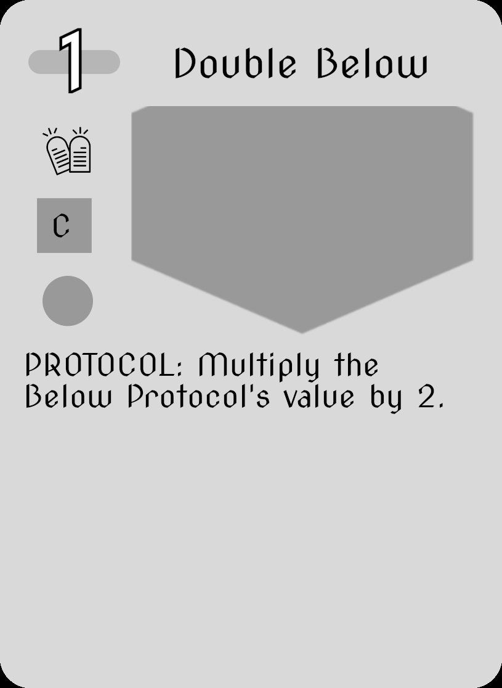

# OVERVIEW
Play as a Machine Priest tasked with purging the VIRUS infecting your faith. 
How far are you willing to bend the rules to restore order?

_Index 1391_ is a roguelike deckbuilder based within the mix between Gothic and computer.
The world is a digital simulation, from which, a holy computer operates every facet of life.
This machine embodies perfect order, everything is a cog in the machine.
The VIRUS is the opposite, an entity of pure chaos, sent to disrupt the sanctum and ruin its harmonious conformity. 
The player is tasked with removing this malicious visitor.
They must use cards and **The Stack** to do so.

Cards represent actions to perform, and **The Stack** is the medium from which those actions are resolved.
The Stack represents a delayed resolution structure, where actions resolve from top to bottom, generally in the order of play. 
Cards and enemies have actions that are played into the Stack, which resolves at the end of the player's turn. 
After the Stack resolves, actions stay in the Stack for the next turn, generating persistence.
The Stack does have a limited capacity, and when overflowed, older (bottom) elements are pushed out of the Stack.

The Stack is often a background structure within games to support resolution, _Index 1391_ is using it as a primary foreground mechanic, from which the player directly interacts.

# CONTRIBUTIONS
## GAME DESIGN RESEARCH
To establish a basis for the design of the game, I did background research into the **Stack** mechanic as seen through other games.
While widely popularized by Magic The Gathering (1994), the stack as a resolution system predates collectible card games and has persisted across decades of board and card game design.

In this research project, I investigated the historical emergence and evolution of stack-based resolution systems by sampling a range of tabletop games over time.
This analysis allowed me to trace how the mechanic developed, adapted, and ultimately became a standard, yet largely background feature in game design.

Building on these findings, _Index 1391_ introduces a novel design approach by bringing the stack into the foreground as the central zone of player interaction.
Instead of functioning passively, the stack becomes an active, visible structure that players directly engage with during gameplay.

To evaluate the games design, I conducted player surveys examining two key questions: 
how understandable a complex resolution mechanic is when presented as a primary interface, 
and how players feel about interacting with such a system directly. 
The results contribute both a historical perspective on the stack and new insights into player experience when foundational mechanics are pushed to the forefront.

The paper can be found [here](/Publications/Resolution_Stack_Research.pdf).

## GAME DESIGN
I was the lead designer on the project, and therefore responsible for the design of the game's core mechanics.
I created documentation related to the game's mechanics and design decisions.
I will outline a couple of key design problems and their solutions.

### COST OF CARDS
#### PROBLEM
The initial design of the game directed that the cost of the cards would be tied to a limited amount of energy awarded per turn.
This initial energy per turn would be 3.
This system copied _Slay the Spire_'s systems, yet felt detached from the game's **Stack** mechanic.

#### SOLUTION
The solution was to introduce a new mechanic that would allow the player to spend energy on the **Stack** itself.
The cost of the cards would be tied to the amount of space a related Protocol/action would take up on the Stack. 
The Stack would limit the amount of cards played through overflowing, rather than a set energy limit. 

### STACK OVERFLOW
#### PROBLEM
The Stack was limited to 10 size of actions it could hold, with each action taking up 1 or more spaces.
The initial design had the Stack overflow and clear the entire Stack.
The limit and subsequent overflow was enacted to act as an interaction space, and to remove some cognitive load from the player.
Despite this, the overflow clearing the Stack was not a natural part of the gameplay, it caused strategy to revolve around clearing the Stack, disrupting the enemies action economy.
We wanted gameplay to revolve around the cards and the interactions within the Stack, not just the Stack overflowing.

#### SOLUTION
Overflow was changed to push older actions out of the Stack from the bottom. 
This operated much like the queue data structure rather than a stack.
This was successful in changing the gameplay to be more intuitive, building in longer term strategies as protocols on the Stack could linger for longer before being cleared.
It also made cost of cards not a pure downside, as larger cost cards could push more unwanted protocols out of the Stack, while also being easier to push out themselves.

### ARCHETYPES
#### PROBLEM
Cards were designed around three archetypes:
- **AGGRO**: Aggressively and chaotically attacking enemies with little regard for defense.
- **CONTROL**: Controlling the Stack, weighting defensive actions more heavily.
- **COMBO**: Creating the perfect sequence of actions to maximize damage.

- These three archetypes had some dissonance with the game's **Stack** mechanic. 
For one, our narrative, design, and aesthetics were heavily influenced by the dichotomy of Order vs Chaos.
Introducing a third archetype to this made this relationship less clear.
Furthermore, the strategies of the archetypes were not well defined, leading to a lack of consistency in the gameplay and clarity in content design.

#### SOLUTION
The archetypes were downsized to two:
- **CHAOS**: Chaos embodies powerful unpredictability, cards could be powerful or weak depending on chance. Embodies the VIRUS.
- **ORDER**: Order is personified by predictable outcomes to play actions. Every card will have a predictable outcome. Embodies the Sanctum the player is defending.
 
- This simplified the gameplay and content design, with the archetypes being more easily understood and defined.
  Card content was streamlined to focus on the Stack from within the framework of an archetype.
  This change also aligned with the narrative and aesthetics of the game, creating a more cohesive and consistent experience.

## PROTOTYPING
To generate content and refine the game's mechanics, a paper prototype was created.
This prototype was used for the first semester of the project, and was periodically revisited to assess design without technical debt.
Using Python and Gimp, I setup card image creation automation from a Google spreadsheet.
Paper cards were first created in a spreadsheet, then using python, automatically generated images from a Gimp template.
They then were printed, cut, and sleeved into a deck with a solid backing.
These were used with die and 3d printed pieces, and paper rules, to create a gameplay experience. 
A moderator was present to act as the computer behind the gameplay, moving pieces and performing enemy actions. 

I managed this process from the start, generating paper content, rules, and guides from which the paper prototype was rendered functional.
The prototype allowed for rapid iteration of mechanics at an extremely low cost. 
This also limited technical debt, as the paper prototype was a reliable reference for the game's mechanics.

Below is an example of a card from the 3rd version of the paper prototype. 

## CONTENT DESIGN & IMPLEMENTATION
I was responsible for the content design of the game, the cards, enemies, doctrines, keywords etc.
This started with generation of ideas in spreadsheets, testing them on paper, and finally creating them within our Unity game engine.
Content was created in a modular way, leveraging the CAT (Content Authoring Tool) to generate pieces that linked to one another.
This tool, along with a sandbox tool, allowed for easy content creation and testing.
I generated a majority of the card and doctrine content within the game through the CAT and related tools.

As a part of this work, I also did extensive QA testing of the game's mechanics.
After creating each item of content, I tested it multiple times leveraging our tooling to ensure it was working as intended.
In some cases unit tests were leveraged on specific components to ensure they were working. 
Through such a process, I often found bugs within backend systems and would work on documenting them to ensure they would be fixed.
Such discovery of bugs caught critical issues early, allowing for more time to fix critical infrastructure, and exposed me to almost every system in the game.

Each content update had a log of changes made. This allowed for a clear history of design and allowed for others to easily test new content. 
Below is an example of a changelog I created for a content update within the game. 

### [4/17/2026] CONTENT PATCHES
#### DESIGN CHANGES

* Redraws now cannot be performed after the player plays a card. They also don’t draw an extra card.  
  *This was to nerf them, with the expanded card advantage, they should feel more like a mulligan, rather than a card advantage piece. It now lets the player get out from a bad hand, but not abuse it for card advantage.*
* Starting Deck has 1 less Deprioritize and 1 less Scripture in the deck.  
  *Removing some of the power of the starting deck, I want to try keeping a card draw option in the deck.*

* Reward generation follows a 1 aggro, 1 control, random generation.  
  *Removing some random from the generation. It doesn't support knowing what the player is doing yet, as that was trickier to enable quickly with how the deck works right now. Yet this can work as a patch until we refine the generation systems over the summer.*

  
#### DOCTRINES
##### BALANCING

* **Reckless R `reckless`**  
  Changed to also halve player block protocols that are added to the stack.  
  *A nerf to reckless to make it feel more “reckless”. This balances it to be more aggressive but dampens the players ability to defend themselves. We could buff its damage potential in the future if the halving block is too much of a downside.*

##### ADDITIONS
* **Shielded C `shielded`**  
  Gain 5 Shield at the start of your turn;  
  *A small doctrine, this will help the life loss strategies and can combat enemy decompile and rampant chipping.*

* **Learned UC `learned`**  
  At the start of stack resolution, draw cards equal to empty spaces on the Stack / 2;  
  *This doctrine will encourage leaving space open on the stack. I think it's interesting at least. Might be very very good.*

#### CARDS

##### BALANCING

* **C-1 R Silence `c_cancel_stack_resolution`**  
  Removed Immutable.  
  *Didn’t need it, and given this is the rare variant, it feels better to be able to move the silence around rather than watch it leave the stack.*

* **C-2 C Scripture  `c_draw`**  
  Now has \[Immutable\]  
  *Gives it less ability to change its card advantage*
* **C-1  UC Resolute Smite `c_damage_per_block`**  
  Now has \[Immutable\]  
  *Makes it hard to scale up value. I could've hardcoded it, yet I wanted flexibility in the future to potentially scale this effect.*

##### ADDITIONS

* **C-2 UC Fleeting Silence**: **`c_cancel_stack_resolution_feeble`**  
  Cancel Stack Resolution; \[Feeble-1\]   
  *Limited life 1-time silence effect to add another one into the mix. Technically it could run multiple turns.*

* **T-1 UC Disruption Prayer**: **`t_shuffle_all_enemy`**  
  Shuffle all Enemy Protocols on the Stack;  
  *Meant to disrupt enemy protocol placement, potentially gaining advantage when moving utility protocols above player protocols.*
* **C-1 UC Uproot**: **`c_destroy_all_unstable`**  
  Destroy all Protocols on the Stack; \[Unstable\]  
  *A rare commandment which destroys, yet its unpredictability could either be frustrating or fun, so we will have to see.*
* **C-2 UC Incessant Spike**: **`c_damage_loop_unstable_grow`**  
  Deal 1 Damage; Loop Self; \[Unstable\] \[Grow-2\]  
  *This card could go crazy by itself, or be worthless. High Reward, but really no risk. I think it could be fun. Very bad odds to be better than smite.*
* **T-1 C Vex**: **`t_swap_top_enemy_draw`**  
  Swap the first 2 enemy protocols; Draw 1;  
  *Meant to disrupt enemy protocol placement, with a card draw if it has no valid targets.*
* **C-2 UC Triumphant Smite**: **`c_damage_if_top_rampant_add`**  
  Deal 10 damage if on the Top of the Stack; \[Rampant\]-Add 5 to this;  
  *A fun conditional damage card, where you try to move it up over and over again. Great with Prioritize on its own.*

## PROGRAMMING
In addition to generating content within the game, I programmed parts of the game's systems to allow for content to function.
The most important items I contributed are below.

- **Run Systems:** Management of the player's deck and health over the course of the game.
- **Effects:** The individual modular components that make up an effect. Predicates, gates, and operations. These are scripts that deal damage, draw cards, target enemy protocols etc. These were linked to in the CAT and other external tools to easily edit content within the game.
- **Handlers:** The Handlers for doctrines, allowing them to have custom functionality.

- **Tool Extensions:** Extensions to the CAT and relational tools to improve functionality.

## UI PROGRAMMING
I programmed various aspects of the game's UI, most importantly the Cards and non-battle screens. 
I did not design or created UI assets, I simply programmed the UI to function based on designs.

- **Hand UI:** The hand of cards that the player interacts with. Controls when and where a card can be played, and can be reordered to the player's liking.
- **Card UI:** The cards themselves, implementation of UI designs that programmatically create cards when needed (such as when a card is drawn).
- **Card Screen UI:** UI screens to display cards and related information. These leverage pooling to reduce the number of objects created. They also have toggleable interactively depending on the application.

- **Other Node Screens:** The various screens that the player interacts with outside the main battle screen and map screen.

